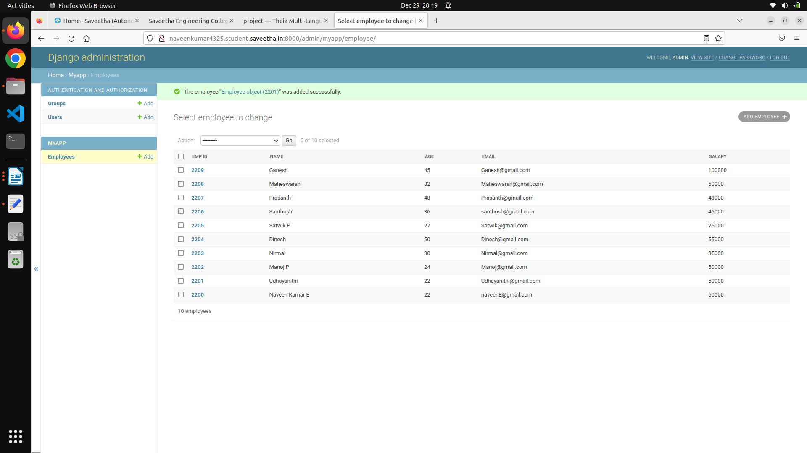
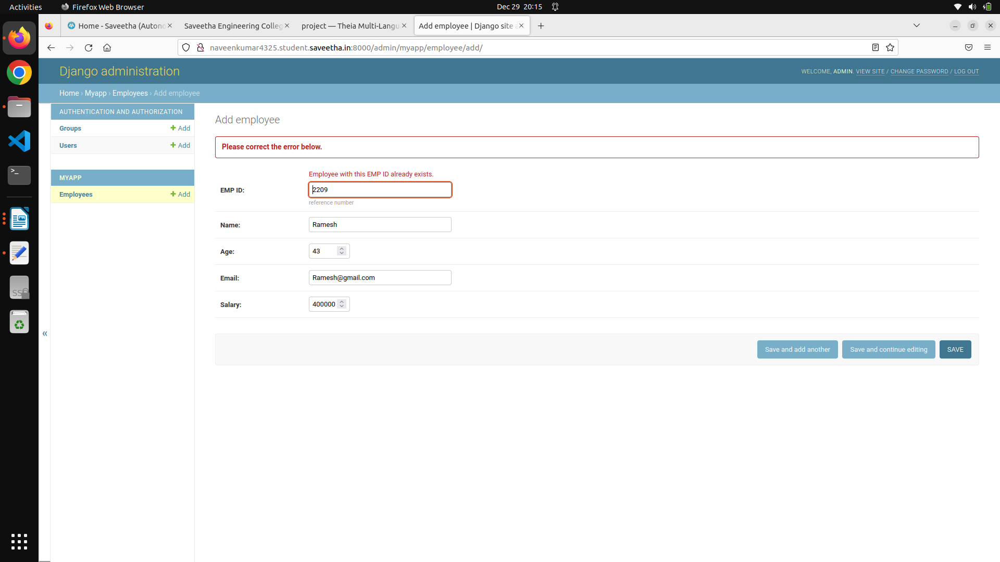

# Django ORM Web Application

## AIM
To develop a Django application to store and retrieve data from a database using Object Relational Mapping(ORM).

## Entity Relationship Diagram


## DESIGN STEPS

### STEP 1:

Create a new Django project using "django-admin startproject",get into the project terminal and use "python3 manage.py startapp"
command

### STEP 2:

Define a model for the Employees in the models.py.Allow host acess and add the app name under installed apps in setting.py

### STEP 3:

Register the models with the Django admin site. In admin.py under app folder, register the models with Django admin site.

### STEP 4:

Run the python manage.py makemigrations and the python manage.py migrate commands to create the necessary database tables for the Employee model. Run the server using "python3 manage.py runserver 0:8000" command.

## PROGRAM
```
#IN models.py:-

from django.db import models
from django.contrib import admin
# Create your models here.
class Employee(models.Model):
    EMP_ID=models.CharField(primary_key=True,max_length=20,help_text='reference number')
    name=models.CharField(max_length=100)
    age=models.IntegerField()
    email=models.EmailField()
    salary=models.IntegerField()

class EmployeeAdmin(admin.ModelAdmin):
    list_display=('EMP_ID','name','age','email','salary')

#IN admin.py:-

from django.contrib import admin
from .models import Employee,EmployeeAdmin

# Register your models here.
admin.site.register(Employee,EmployeeAdmin)
```
## OUTPUT






## RESULT

Successfully developed a Django application to store and retrieve data from a database using Object Relational Mapping(ORM).